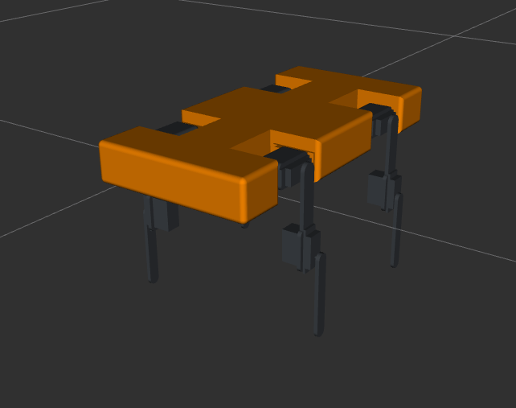

# Robotic-dog-simulation
I'm currently learning ros2 and making a robot dog simulation  
I want to share all my docs, current steps and future updates I want to make to this simulation, I'm using ROS2 Jazzy running in Ubuntu 24.04.04 with gazebo harmonics, In this repository is all of my package files including the IK code, the URDF model to the robot and the launch files for the gazebo simulation. I have some files already done and a basic test model of my robot, so i will show and try to explain it for you.  
# My package  
My package is used for two things at the same time:  
- Starting the gazebo  
- Rotating the node that makes it walk (He still can't walk)
  
He starts the gazebo with a launch file, and runs the node normaly like other packages, I will put the commands in later topics.    
# Installation  
First you have to make sure the ROS2 jazzy is installed in your system by running  
```bash
ls /opt/ros
```
If returns jazzy it is installed, if not you have to install it by going to the ROS2 jazzy documentation.  
After making sure of this you have to create a worksapce  
```bash
cd ~
mkdir program_ws/src
cd program_ws/src
```
Clone the repository  
```bash
git clone https://github.com/P4TOOOO/Learning-ROS2--Robot-dog.git
```
Install dependencies  
```bash
cd /program_ws
rosdep update #only once
rosdep install --from-paths src --ignore-src -r -y
```
Build the package  
```bash
colcon build
```
The package is installed in your workspace, now you need to source it to run the package, first source the ROS2 itself
```bash
cd ~
source /opt/ros/jazzy/setup.bash
```
Source the package  
```bash
source program_ws/install/setup.bash
```
Now you are ready to run the node for the gazebo sim of my robot.  
# Robot Model
This is my test model:  

  
  

  
It has 12 joints, 3 in each leg, hip, thigh and shin, (he is a little ugly but no problem) I build it with onshape cad and translated to URDF by onshape-to-robot commands.  
## Joint limits  
The limits of the joints, is essentially a hardware limit imposed by the motors that I will use (when I build it), with will be the MG995 servo motors because they are cheap and affordable for me, or they are limits of the structure of the robot design that not allow the motors to continue rotating. Anyway, in my URDF model I believe these limits are wrong or they are rotating in the opposite direction to what I would like. I'll check this and I'll probably have to redo the model correctly.
# Inverse kinematics  
In this section I'm going to talk about the IK to this robot, initially, I had created an inverse kinematics model that only considered the final position of the robot's "foot," but then I started reading a book called "Modeling and Control of Robot Manipulators" by Sciavicco ad Siciliano, and I realized that the way I had done it was probably wrong, but the book takes that into account the position and the orientation of the end-factor, "foot" of the robot, but in my project since the orientation does not change I only have to take into account the final position, I don't know how I'm going to continue doing this part. Anyway this is my IK model and formulas only taking into accout the final position:  
## Side view:  
  
  
  

## Front view:  

  
  
# Lauch Files  
In this section I'm going to explain the code of my  launch file and show how to run it  
```python
from launch import LaunchDescription
from launch.actions import IncludeLaunchDescription, TimerAction
from launch.launch_description_sources import PythonLaunchDescriptionSource
from launch_ros.actions import Node
from ament_index_python.packages import get_package_share_directory
import os
```
This part is the imports of some libraries that I use for making the launch file
```python
def generate_launch_description():
    pkg_dir = get_package_share_directory('robotic_dog')
    urdf_path = os.path.join(pkg_dir, 'urdf', 'robot.urdf')
```
I'm creating the function of the launch file and especifing the paths for the URDF and the package name  
```python

# ROS2 node-code  
# Path Motion  
# Walking  
# Controlling by the keyboard  


