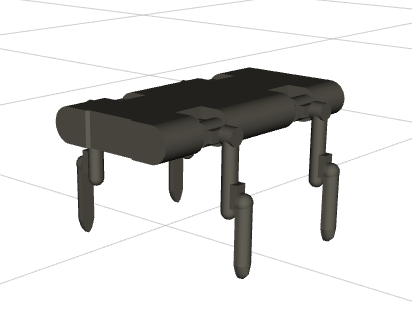
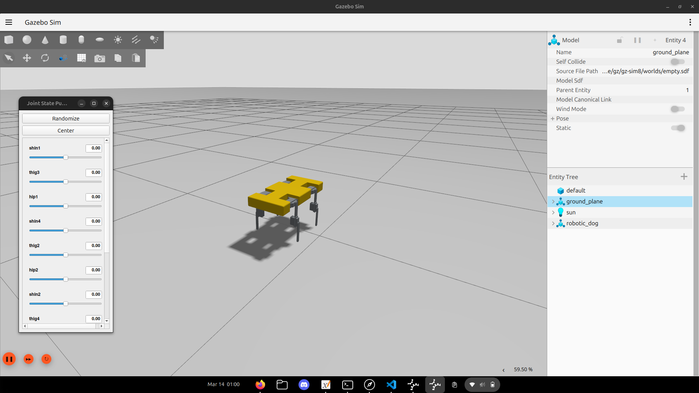
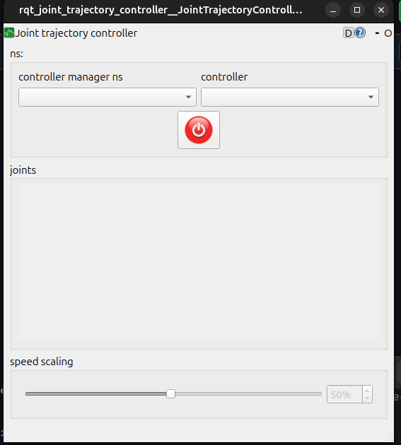
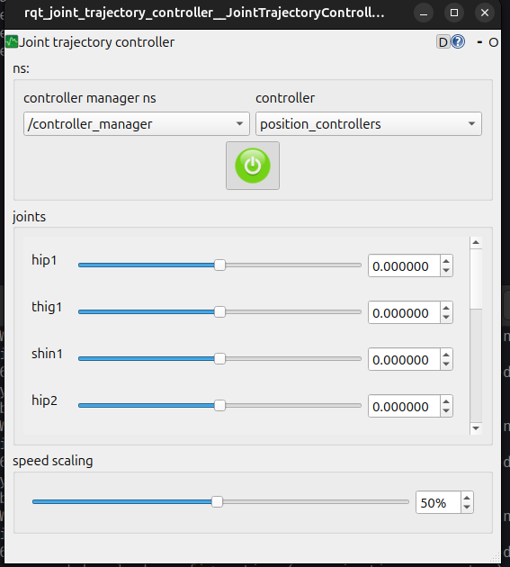

# Robotic-dog-simulation
I'm currently learning ros2 and making a robot dog simulation  
I want to share all my docs, current steps and future updates I want to make to this simulation, I'm using ROS2 Jazzy running in Ubuntu 24.04.04 with gazebo harmonics, In this repository is all of my package files including the IK code, the URDF model to the robot and the launch files for the gazebo simulation. I have some files already done and a basic test model of my robot, so i will show and try to explain it for you.  
# My package  
My package is used for two things at the same time:  
- Starting the gazebo  
- Rotating the node that makes it walk (He still can't walk)
  
He starts the gazebo with a launch file, and runs the node normaly like other packages, I will put the commands in later topics.    
# Installation  
First you have to make sure the ROS2 jazzy, and gazebo harmonics is installed in your system by running  
```bash
ls /opt/ros
```
If returns jazzy it is installed, if not you have to install it by going to the ROS2 jazzy documentation.  

  
After making sure of this you have to create a worksapce  
```bash
cd ~
mkdir -p program_ws/src
cd program_ws/src
```
  
Clone the repository  
```bash
git clone https://github.com/P4TOOOO/Learning-ROS2--Robot-dog.git .
```

Install dependencies  
```bash
cd /program_ws
rosdep update #only once
rosdep install --from-paths src --ignore-src -r -y
```

Build the package  
```bash
colcon build
```

The package is installed in your workspace, now you need to source it to run the package, first source the ROS2 itself
```bash
cd ~
source /opt/ros/jazzy/setup.bash
```

Source the package  
```bash
source program_ws/install/setup.bash
```

Now you are ready to run the node for the gazebo sim of my robot.  
# Robot Model
This is my test model:  

  
  

  
It has 12 joints, 3 in each leg, hip, thigh and shin, (he is a little ugly but no problem) I build it with onshape cad and translated to URDF by onshape-to-robot commands.  
## Joint limits  
The limits of the joints, is essentially a hardware limit imposed by the motors that I will use (when I build it), with will be the MG995 servo motors because they are cheap and affordable for me, or they are limits of the structure of the robot design that not allow the motors to continue rotating. The limits os the joint are now fixed with no problem at all.
# Inverse kinematics  
In this section I'm going to talk about the IK to this robot, i made this section and other math solutions to the robot using the book "modeling and control of robot manipulators" using the anthropomorphic arm as a base    
  
# Lauch Files  
In this section I'm going to explain the code of my  launch file and show how to run it  
```python
from launch import LaunchDescription
from launch.actions import IncludeLaunchDescription, TimerAction
from launch.launch_description_sources import PythonLaunchDescriptionSource
from launch_ros.actions import Node
from ament_index_python.packages import get_package_share_directory
import os
```
This part is the imports of some libraries that I use for making the launch file
```python
def generate_launch_description():
    pkg_dir = get_package_share_directory('robotic_dog')
    urdf_path = os.path.join(pkg_dir, 'urdf', 'robot.urdf')
```
Here I'm creating the function of the launch file and especifing the paths for the URDF and the package name  
```python
return LaunchDescription([
```
This line return all the actions make by the launch  
```python
IncludeLaunchDescription(
    PythonLaunchDescriptionSource(
        os.path.join(get_package_share_directory('ros_gz_sim'), 'launch', 'gz_sim.launch.py')
    ),
    launch_arguments={'gz_args': '-r empty.sdf'}.items()
),
```
This opens the gazebo using the ros_gz_sim package  
```python
        Node(
            package='robot_state_publisher',
            executable='robot_state_publisher',
            parameters=[{'robot_description': open(urdf_path, 'r').read()},{'use_sim_time': True}],
            output='screen',
```
Here we publish the URDF model to the gazebo and after it spawns the robot  
```python
 Node(
            package='ros_gz_sim',
            executable='create',
            arguments=[
                '-topic', '/robot_description',
                '-name', 'robotic_dog',
                '-allow_renaming', 'false',
                '-x', '0.0',
                '-y', '0.0',
                '-z', '1.5',
                '-Y', '0.0'
            ],
            output='screen'
        ),
```
And finaly spawn the controlls for the robot using controller_manager package
```python
        TimerAction(
            period=8.0,  # 8 segundos de delay
            actions=[
                Node(
                    package='controller_manager',
                    executable='spawner',
                    arguments=['joint_state_broadcaster', '--controller-manager', '/controller_manager'],
                    output='screen',
                    parameters=[{'use_sim_time': True}]
                ),
                Node(
                    package='controller_manager',
                    executable='spawner',
                    arguments=['position_controllers', '--controller-manager', '/controller_manager'],
                    output='screen',
                    parameters=[{'use_sim_time': True}]
                ),
            ]
        ),
```
## Running the simulation  
First make sure to build and source the pkg if everything works out run the following command to initiate the gazebo simulation  
```bash
ros2 launch robotic_dog gazebo.launch.py
```
The gazebo will apear like this:    

  

The joint publisher is now working but to make it work you have to install one package.
```bash
sudo apt install ros-jazzy-rqt-joint-trajectory-controller
```
This package allows us to use another way to publish the data, and to run the new publisher
```bash
ros2 run rqt_joint_trajectory_controller rqt_joint_trajectory_controller
```
Another window will apear and look like this  

  
  


to make it work you have to select the controler manager and the controller and if everything works you will have this  

  


But if you want to publish manualy run
```bash
ros2 topic pub --once /position_controllers/joint_trajectory trajectory_msgs/msg/JointTrajectory "{
  header: {stamp: {sec: 0, nanosec: 0}},
  joint_names: ['hip1', 'thig1', 'shin1', 'hip2', 'thig2', 'shin2', 'hip3', 'thig3', 'shin3', 'hip4', 'thig4', 'shin4'],
  points: [
    {
      positions: [0.0, 0.0, 0.0, 0.0, 0.0, 0.0, 0.0, 0.0, 0.0, 0.0, 0.0, 0.0],
      velocities: [],   # optional
      accelerations: [], # optional
      time_from_start: {sec: 2, nanosec: 0}
    }
  ]
}"
```
With each of these values being the value of a specific motor of the robot where the order of the values correspond respectively to  
* [hip1, thig1, shin1, hip2, thig2, shin2, hip3, thig3, shin3, hip4, thig4, shin4]  
# Principal node  
I will explain my principal code but note that it does not work properly I'm triyng to fix it and make a walking motion but it will take a time to finish  
The imports look like this  
```python
import math
import rclpy
from rclpy.node import Node
from std_msgs.msg import Float64MultiArray
import matplotlib.pyplot as plt
```
The initialization looks like this it only initiate the node  
```python
class RoboticDogNode(Node):
    def __init__(self):
        super().__init__('robotic_dog_node')
```
Make a publisher class to publish the value to the simulation motors and the "lado" variable set the link lenth both are the same  
```python
        self.lado = 10.0 
        self.command_publisher = self.create_publisher(
            JointTrajectory,
            '/position_controllers/joint_trajectory',
            10
        )
        self.joint_names = ['hip1', 'thigh1', 'shin1', 'hip2', 'thigh2', 'shin2', 'hip3', 'thigh3', 'shin3', 'hip4', 'thigh4', 'shin4']

```
Set the path points posotions and time the delay of each leg, the number of steps in between each point generate the trajectory and make some lists to plot the results  
```python
        self.start_pos = (10.0, 12.0, 5.0)
        self.end_pos = (10.0, 12.0, 5.0)
        self.path_points = [ (10.0, 7.0, 3.0), (10.0, 14.0, 7.0), (10.0, 14.0, -7.0), (10.0, 7.0, -3.0), (10.0, 5.0, 0.0)]
        self.path_times = (0.0, 0.5, 1.0, 1.5, 2.0)
        self.delay_steps = 90
        self.leg_delays = [0, self.delay_steps, 60, self.delay_steps+60]
        self.steps_per_segment = 30
        

        # Gera a trajetória
        self.trajectory = self.generate_trajectory_forward(self.path_points, self.path_times, self.steps_per_segment)
        self.trajectory_length = len(self.trajectory)

        self.positions = []
        self.all_angles = []
        self.current_step = 0
```
Make the timers and sincronize with the gazebo timers  
```python
        self.timer = self.create_timer(0.1, self.movement_callback)
```
Make the IK calculus for the left pair of legs  
```python
def calculate_ik_left(self, Pwx, Pwy, Pwz):
        """IK apenas para as pernas ESQUERDAS (1 e 2)"""
        a2 = self.lado
        r = math.sqrt((Pwx**2) + (Pwy**2))
        D_sq = (Pwx**2) + (Pwy**2) + (Pwz**2)
        D = math.sqrt(D_sq)

        if D > 2 * a2 or D == 0:
            self.get_logger().warn(f"Posição inalcançável (left): ({Pwx}, {Pwy}, {Pwz})")
            return None

        v1 = 0.0                                      # mantendo fixo como você queria
        cosv3 = (D_sq - 2*a2**2) / (2 * a2**2)
        cosv3 = max(-1.0, min(1.0, cosv3))
        senv3 = math.sqrt(1 - cosv3**2)
        v3 = math.atan2(senv3, cosv3)

        senv2 = ((a2 + a2*cosv3)*Pwz - a2*senv3*r) / D
        cosv2 = ((a2 + a2*cosv3)*r + a2*senv3*Pwz) / D
        v2 = math.atan2(senv2, cosv2)

        return v1, v2, v3
```
Make the calculus for the right pair of legs  
```python
def calculate_ik_right(self, Pwx, Pwy, Pwz):
        """IK apenas para as pernas DIREITAS (3 e 4) - com sinais corrigidos"""
        a2 = self.lado
        r = math.sqrt((Pwx**2) + (Pwy**2))
        D_sq = (Pwx**2) + (Pwy**2) + (Pwz**2)
        D = math.sqrt(D_sq)

        if D > 2 * a2 or D == 0:
            self.get_logger().warn(f"Posição inalcançável (right): ({Pwx}, {Pwy}, {Pwz})")
            return None

        v1r = 0.0                                     # mantendo fixo (igual ao esquerdo)
        cosv3 = (D_sq - 2*a2**2) / (2 * a2**2)
        cosv3 = max(-1.0, min(1.0, cosv3))
        senv3 = math.sqrt(1 - cosv3**2)
        v3 = math.atan2(senv3, cosv3)

        # === AQUI ESTÁ A CORREÇÃO PRINCIPAL ===
        # Usamos o MESMO v2 do lado esquerdo (não a fórmula antiga v2r)
        senv2 = ((a2 + a2*cosv3)*(-Pwz) + a2*senv3*r) / D
        cosv2 = ((a2 + a2*cosv3)*r - a2*senv3*(-Pwz)) / D
        v2r = math.atan2(senv2, cosv2)                # ← mesmo v2 das pernas esquerdas

        v3r = -v3                                     # canela invertida (padrão)

        return v1r, v2r, v3r
```
Join the two into 4 different lists, with each list representing a leg.  
```python
def calculate_ik(self, Pwx, Pwy, Pwz):
        # Calcula separadamente para cada lado 
        left  = self.calculate_ik_left(Pwx, Pwy, Pwz)
        right = self.calculate_ik_right(Pwx, Pwy, Pwz)

        if left is None or right is None:
            return None
        
        perna1 = list(left)   # [v1, v2, v3]
        perna2 = list(left)   # [v1, v2, v3]
        perna3 = list(right)  # [v1r, v2r, v3r]
        perna4 = list(right)  # [v1r, v2r, v3r]

        return perna1, perna2, perna3, perna4
``` 
Make a trajectory to traverse all the points specified in the path points.  
```python
    def generate_trajectory_forward(self, path_points, path_times, steps_per_segment):
        trajectory = []
    
        for seg in range(len(path_points) - 1):                    # 2 segmentos para 3 pontos
        # Pontos e tempos do segmento atual
            q0 = path_points[seg]
            qf = path_points[seg+1]
            t0 = path_times[seg]
            tf = path_times[seg+1]
            T  = tf - t0
        
        # Velocidades iniciais e finais do segmento (0 no começo e fim do movimento)
            v0 = (0.0, 0.0, 0.0) if seg == 0 else None   # será calculado no próximo passo
            vf = (0.0, 0.0, 0.0) if seg == 1 else None
        
        # (Aqui você pode calcular v1 automaticamente se quiser, mas para simplicidade usamos 0)
        
        # Coeficientes 
            a0 = q0
            a1 = (0.0, 0.0, 0.0)                     # v0 = 0
            a2 = (
                3*(qf[0]-q0[0])/T**2 - 2*a1[0]/T,
                3*(qf[1]-q0[1])/T**2 - 2*a1[1]/T,
                3*(qf[2]-q0[2])/T**2 - 2*a1[2]/T
            )
            a3 = (
                -2*(qf[0]-q0[0])/T**3 + a1[0]/T**2,
                -2*(qf[1]-q0[1])/T**3 + a1[1]/T**2,
                -2*(qf[2]-q0[2])/T**3 + a1[2]/T**2
            )
        
        # Gera os pontos do segmento
            for i in range(steps_per_segment + 1):
                t = t0 + i * (T / steps_per_segment)
                tau = t - t0
                pos = (
                    a0[0] + a1[0]*tau + a2[0]*tau**2 + a3[0]*tau**3,
                    a0[1] + a1[1]*tau + a2[1]*tau**2 + a3[1]*tau**3,
                    a0[2] + a1[2]*tau + a2[2]*tau**2 + a3[2]*tau**3
                )
                trajectory.append(pos)
    
        return trajectory
```
Callback function to run the node apply the correct delays and publish the results to the gazebo  
```python
 def movement_callback(self):
        if not self.trajectory:
            return

        joint_positions = [0.0] * 12

        # Calcula posição de cada perna com delay + loop infinito
        for leg in range(4):
            delay = self.leg_delays[leg]
            effective_step = self.current_step - delay

            if effective_step < 0:
                pos = self.trajectory[0]                    # ainda não começou
            else:
                # LOOP INFINITO: volta pro início quando chega no fim
                idx = effective_step % self.trajectory_length
                pos = self.trajectory[idx]

            # IK por lado (esquerda ou direita)
            if leg < 2:   # pernas 1 e 2 = esquerda
                ik_result = self.calculate_ik_left(*pos)
            else:         # pernas 3 e 4 = direita
                ik_result = self.calculate_ik_right(*pos)

            if ik_result:
                start_idx = leg * 3
                joint_positions[start_idx:start_idx + 3] = list(ik_result)

        # === PUBLICAÇÃO NO GAZEBO ===
        msg = JointTrajectory()
        msg.joint_names = self.joint_names
        point = JointTrajectoryPoint()
        point.positions = joint_positions
        point.velocities = [0.0] * 12
        point.time_from_start = Duration(sec=0, nanosec=100_000_000)
        msg.points = [point]
        self.command_publisher.publish(msg)

        # Log (para você acompanhar)
        ref_idx = self.current_step % self.trajectory_length
        ref_pos = self.trajectory[ref_idx]
        self.get_logger().info(
            f"Loop {self.current_step:4d} | Ref ({ref_pos[0]:.2f},{ref_pos[1]:.2f},{ref_pos[2]:.2f}) | "
            f"P1+P3: {tuple(round(x,4) for x in joint_positions[0:3])} | "
            f"P2+P4: {tuple(round(x,4) for x in joint_positions[3:6])}"
        )

        # (Opcional) Coleta só da perna 1 para possível plot futuro
        leg1_pos = self.trajectory[ref_idx]
        self.positions.append(leg1_pos)
        self.all_angles.append((
            list(joint_positions[0:3]),
            list(joint_positions[0:3]),
            list(joint_positions[0:3]),
            list(joint_positions[0:3])
        ))

        self.current_step += 1

```
Shows the graph of the function and the graph of the motors angles   
```python
    def plot_results(self):
        if not self.positions:
            return
        xs, ys, zs = zip(*self.positions)
        fig = plt.figure()
        ax = fig.add_subplot(111, projection='3d')
        ax.plot(xs, ys, zs, marker='o')
        ax.set_xlabel('X')
        ax.set_ylabel('Y')
        ax.set_zlabel('Z')
        ax.set_title('Trajetória Simulada')
        plt.show()

        steps = range(len(self.all_angles))
        plt.figure()
        for i in range(3):  
            plt.plot(steps, [a[i] for a in self.all_angles], label=f'{self.joint_names[i]}')
        plt.xlabel('Passo')
        plt.ylabel('Ângulo (radianos)') # Atualizado para radianos
        plt.title('Ângulos da Perna 1 ao longo da trajetória')
        plt.legend()
        plt.show()
```
Start ROS2, create the node, and run it  
```python
def main(args=None):
    rclpy.init(args=args)
    node = RoboticDogNode()
    rclpy.spin(node)
    node.destroy_node()
    rclpy.shutdown()

if __name__ == '__main__':
    main()
```
# Walking  
So for the robot walking I'm trying to make a CoM based walking but I have to change so many things into the code so it may take a while to make it work, I already did a little bit of this movement It is based in the ZMP position and trajectory, and then it puts the CoM in the ZMP position and after calculate the optimal leg positions to it dont fall.  
# Controlling by the keyboard  


